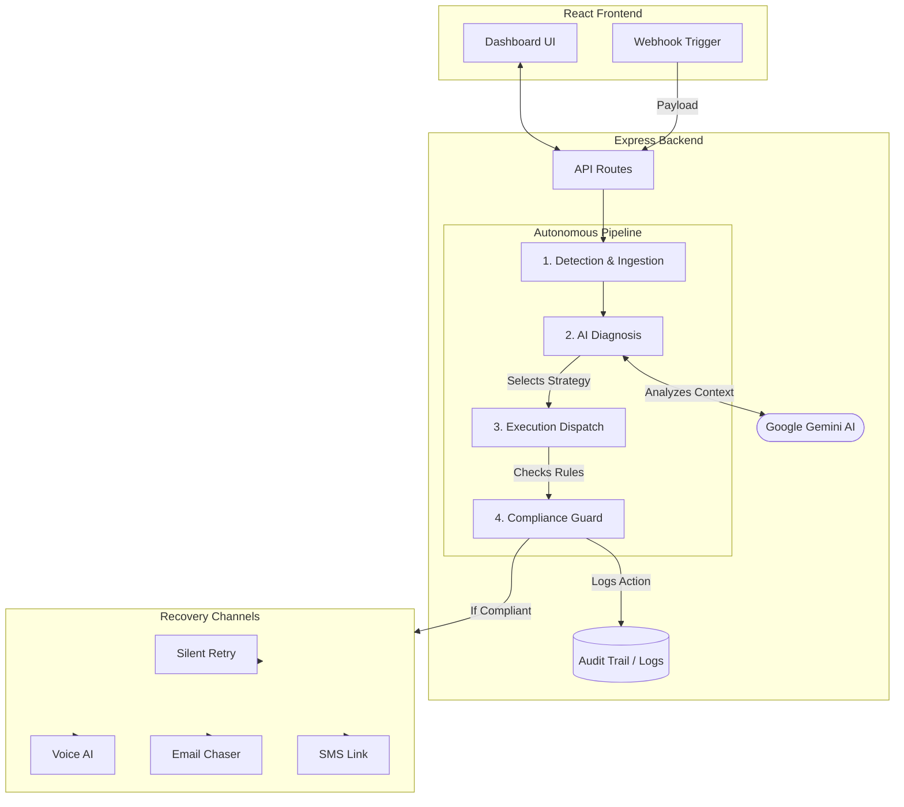

# AI-Driven Revenue Recovery Agent

An autonomous full-stack AI agent designed to monitor, diagnose, and recover lost revenue across payment gateways, subscriptions, and checkouts. It actively moves beyond simply flagging issues to executing a bounded, compliant recovery workflow powered by Gemini.

## ✨ Key Features

- **Autonomous Pipeline:** End-to-end 4-phase workflow covering Detection, AI Diagnosis, Execution, and Compliance.
- **Glassmorphism UI:** A sleek, modern dashboard utilizing dynamic multi-colored ambient backgrounds and frosted glass components.
- **Fluid Bento-Grid Layout:** Incorporates spring physics and layout animations using Framer Motion (`motion/react`) for fluid, tactile tab switching and responsive resizing.
- **Ambient AI Status Orb:** An interactive, glowing status indicator in the header that visually reacts to the agent's diagnostic processing state in real-time.
- **Visual Analytics:** Interactive Recharts-powered graphs visualizing recovery channel distributions and risk event types.
- **Localized Currency Engine:** Real-time financial calculations and metrics natively tracked and formatted in Indian Rupees (INR).
- **Data Export:** 1-click CSV generation for both immutable audit logs and customer registries to support compliance and accounting.
- **Real-Time Notifications:** Integrated toast alerts (Sonner) providing immediate feedback on webhook ingestion, simulation progress, and agent resets.

## 🏗 System Architecture

The application is built using a modern full-stack TypeScript architecture, utilizing React for the frontend and Express for the AI-powered backend. 



### 1. Frontend (Client-Side)
- **Framework:** React 18 + Vite + TypeScript.
- **Styling:** Tailwind CSS, featuring a dynamic, multi-colored glassmorphism UI overlaying an ambient chromatic background.
- **Components:** Modular, responsive dashboard components (`MetricsOverview`, `LiveExecutionFeed`, `CustomerRegistry`, `AuditTrail`).
- **State Management:** React state manages the simulation of real-time data pipelines, webhook ingestion, and live execution traces.

### 2. Backend (Server-Side)
- **Framework:** Node.js with Express + TypeScript.
- **AI Engine:** Google Gen AI SDK (`@google/genai`). The server utilizes Gemini models to act as the **Diagnosis Engine**. It analyzes incoming risk events (e.g., checkout abandonment, subscription failures) and dynamically determines the optimal recovery channel (Smart Retry, Voice Call, Email, or SMS) based on contextual clues.
- **Security:** API keys and external service integrations are securely hidden server-side, with a robust REST API exposing capabilities to the client.
- **Build System:** Uses `esbuild` to compile the backend into a standalone CommonJS bundle (`dist/server.cjs`) for lightweight, efficient containerized deployment alongside the Vite static assets.

### 3. Core Pipeline Logic (The 4 Phases)
The agent operates on a strict, compliant 4-phase state machine:
1. **Detection & Ingestion:** Monitors data streams (via webhooks or internal pulses) for risk events.
2. **Diagnosis & Strategy:** The Gemini AI agent analyzes the root cause, customer context, and region to select the most effective intervention channel.
3. **Execution:** Triggers the chosen workflow (e.g., simulated payment gateway retries, regional voice AI, SMS sequences).
4. **Compliance:** Enforces strict stopping rules (max contacts per day, opt-out protections, settled debt blocks) and maintains an immutable audit trail.

## 📂 Project Structure

```text
├── src/
│   ├── components/      # React UI Components (Header, Data Feeds, Modals)
│   ├── App.tsx          # Main React Application & Layout
│   ├── main.tsx         # Client Entry Point
│   ├── server.ts        # Express Backend & Gemini Agent Integration
│   ├── types.ts         # Shared TypeScript Interfaces (Events, Customers)
│   ├── engine.ts        # Core Pipeline & Execution Logic
│   └── index.css        # Tailwind CSS & Global Styles
├── dist/                # Production Build Output (Client static files & server.cjs)
├── package.json         # Dependencies & Build Scripts
└── vite.config.ts       # Vite Configuration
```

## 🚀 Getting Started

### Prerequisites
- Node.js (v18+)
- `GEMINI_API_KEY` (Required for the AI Diagnosis Engine)
- **External Service Keys** (Optional, required for production channel execution):
  - `STRIPE_API_KEY` / `RAZORPAY_API_KEY` (For live payment gateway retries & checks)
  - `TWILIO_ACCOUNT_SID` & `TWILIO_AUTH_TOKEN` (For SMS and Voice AI dispatching)

### Installation

1. Install dependencies:
   ```bash
   npm install
   ```

2. Configure Environment Variables:
   Copy the provided `.env.example` file to create a `.env` file in the root directory and populate your keys:
   ```env
   # .env
   PORT=3000
   GEMINI_API_KEY=your_google_gemini_api_key
   
   # Optional Execution Integrations
   STRIPE_API_KEY=your_stripe_secret
   RAZORPAY_API_KEY=your_razorpay_secret
   TWILIO_ACCOUNT_SID=your_twilio_sid
   TWILIO_AUTH_TOKEN=your_twilio_token
   ```

3. Start the Development Server:
   ```bash
   npm run dev
   ```
   *The server runs locally, exposing both the frontend and the Express API on port 3000.*

### Production Build

To build the application for production (compiles both the React frontend and the Express backend):

```bash
npm run build
npm start
```
